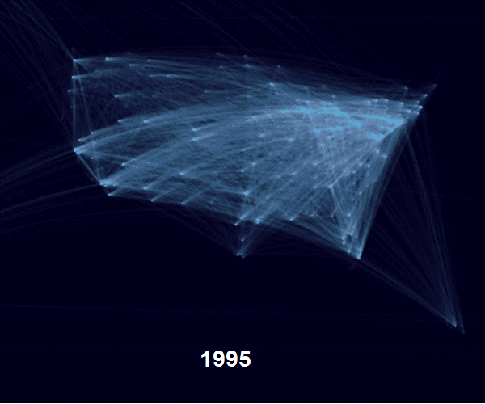

# US flights
_Data visualization of unique air routes across the US from 1995-2015_

Inspired by the AirBNB visualization and [blog post](https://medium.com/airbnb-engineering/using-r-packages-and-education-to-scale-data-science-at-airbnb-906faa58e12d#.czt4te24n) by [Ricardo Bion](https://github.com/ricardo-bion/medium_visualization), I incorporated data from the TranStats website with some R code to create a similar visualization. I was also interested in seeing how much more connected US cities have become in the last 20 years by means of air travel. 

## Data
Source: [TranStats, US Carriers Domestic Market, T-1000](http://www.transtats.bts.gov/Tables.asp?DB_ID=110&DB_Name=Air%20Carrier%20Statistics%20%28Form%2041%20Traffic%29-%20%20U.S.%20Carriers&DB_Short_Name=Air%20Carriers). Only service class "F" flights were included, defined as scheduled passenger/cargo service flights.  
_It's also cool to see the BTS using [Highcharts](http://www.highcharts.com/) for their [data viz](http://transtats.bts.gov/)_

